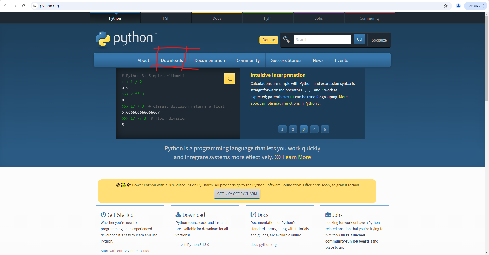
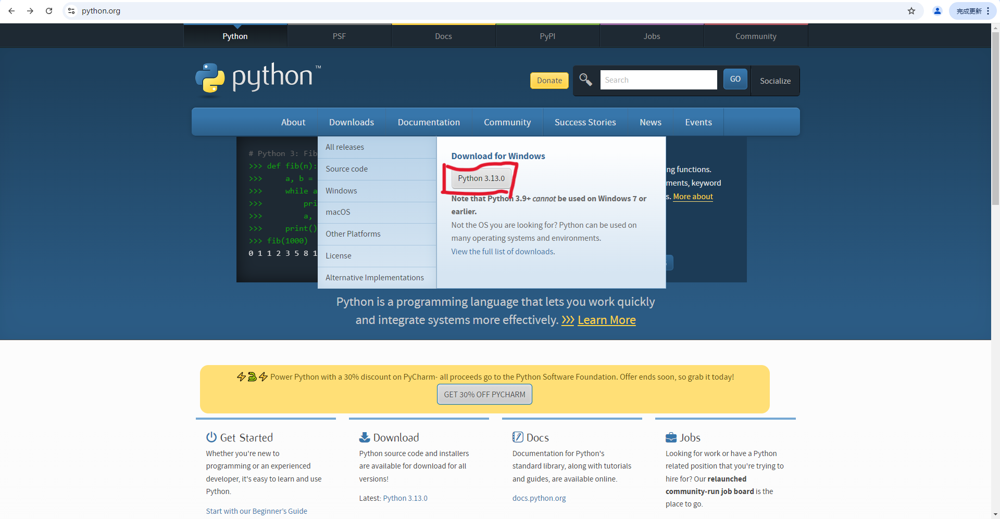

# NFLS信息作业
### mzy我太善了嘻嘻
记得改开头注释
### [赞助](https://mzy.black-hole.asia/)
 
# 使用前必看！！！！！！！： 

## 引言
感谢20230648wxy提供的issue，我发现并不是所有人电脑里都有python解释器  
因此，mzy决定再出一期python解释器安装教程  
**请注意**：全部步骤按照教程，mzy不解答所有教程中提过的问题  
## Step.0
**去赞助mzy**
## Step.1
访问[python官网](https://python.org)  
  
将鼠标放置在download键上而**不要点击**

点击上图中红框框起来的地方，你上面显示的版本可能和图片中的不一样，但是没关系  
接下来，你的浏览器应该会提示开始下载软件  
